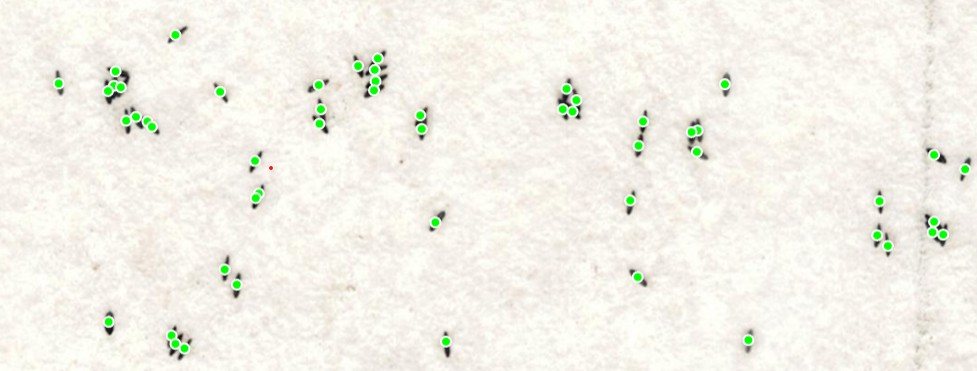

# Egglytics

 

## For Developers
## I. Initial Requirements
1. Install [Postgres](https://www.postgresql.org/download/)
2. Activate Venv and install requirements using "pip install -r requirements.txt" for both web application and compute

## II. Initial Database Setup
1. Login to postres using Shell "psql -U posgres"
2. Create a database using "CREATE DATABASE egglytics;"
3. Check if the database is created using "\l"

## III. Initial env setup
1. Create a .env file on ROOT of web application folder
2. In this .env file add these lines

SECRET_KEY="YOUR_KEY"

DB_NAME='egglytics'

DB_USER='postgres'

DB_PASSWORD='YOUR_POSTGRES_PASSWORD'

DB_HOST='localhost'

DB_PORT='5432'

3. On SHELL go to ROOT directory of the webapplication and activate venv
4. Change directory to server "cd server"
5. Create the tables in the database using "python manage.py migrate"
6. To test for creation success in the Postgres shell connect to the database "\c egglytics"
7. Check if the tables are there using "\d"
   
### IV. Running the Web Application
1. On SHELL go to ROOT directory and activate venv
2. Change directory to server "cd server"
3. Run the server using "python manage.py runserver"
4. Access website on Localhost port 8000 (http://127.0.0.1:8000/)

### V. Running the Compute server
1. On SHELL go to ROOT directory and activate venv
2. python app.py

### VI. Deploying Your Own Model
A. Web Application to Compute Server Flow
1. The web application server sends images to the compute server using a default base URL ("/").
(To change this, see Notes [A].)
2. The default URL path is defined in server/urls.py.
(To change this, see Notes [B].)
3. In views.py, the function upload(request) receives a list of uploaded image files, encodes them in Base64, and forwards the data to a separate thread. This thread calls the process_images() function, which compiles the data into a JSON payload and sends it to the compute server’s API endpoint. The function then waits for and returns a JSON response from the compute server.
(See Notes [C].)
   
Notes:

[A] The base URL can be modified in
server/egglytics/static/js/image_upload_handler.js, inside the
$("#upload-btn").on("click", function () { ... }) handler.

[B] In server/urls.py, the default route maps to views.upload (see line 5).

[C] By default, the data is sent to:

http://127.0.0.1:5000/upload_base64
Format - PROTOCOL://IP_ADDRESS:PORT/ENDPOINT_PATH

B. Using a different model
1. To use multiple or alternative models, the same workflow can be followed while changing the endpoint path used by the web application to target the desired model on the compute server.
2. By default, each model is implemented as its own class in compute/models.py, which was called after the pre-processing steps done in def upload_base64() function in compute/app.py.
3. You may define custom endpoint paths, preprocessing pipelines, and model inference strategies to suit your deployment needs.
4. Ensure that, after inference, the model returns the expected output data (such as JSON or arrays) back to the web application.

### VII. Important Notes
1. Check gitIgnore before pushing
2. HTML Files on Egglytics/Templates
3. JS Scripts on Egglytics/static/js
4. URLS on Egglytics/urls.py
5. Views on Egglytics/views.py

## For Users
The application is currently in its early development phase and is not yet ready for use.

## To Do List:
1. Frontend fixes
