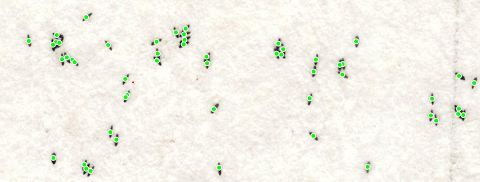
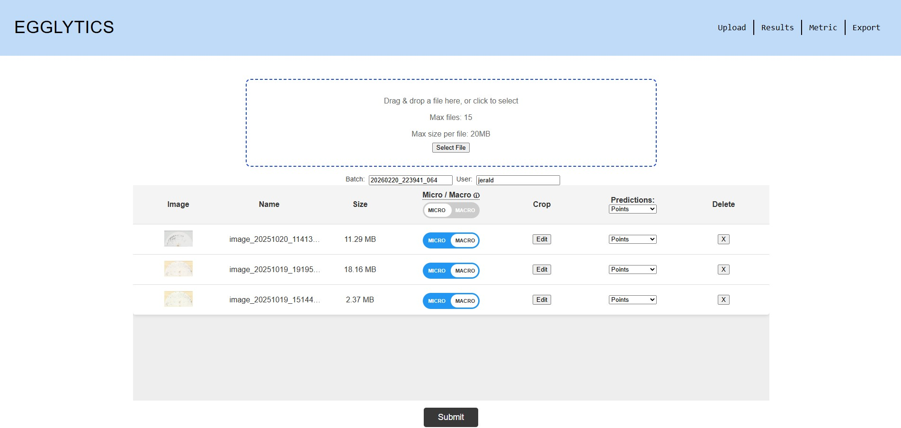
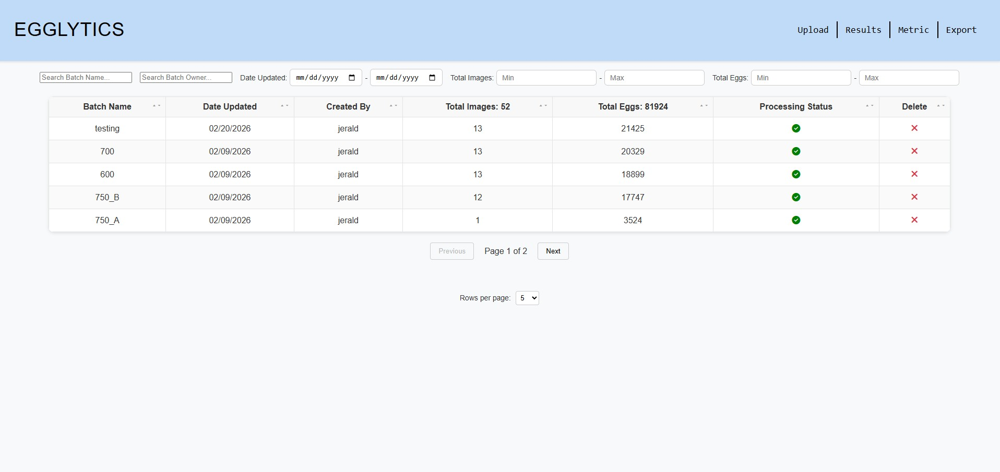
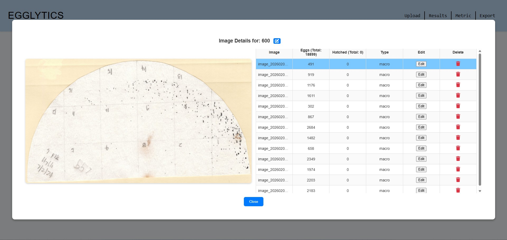
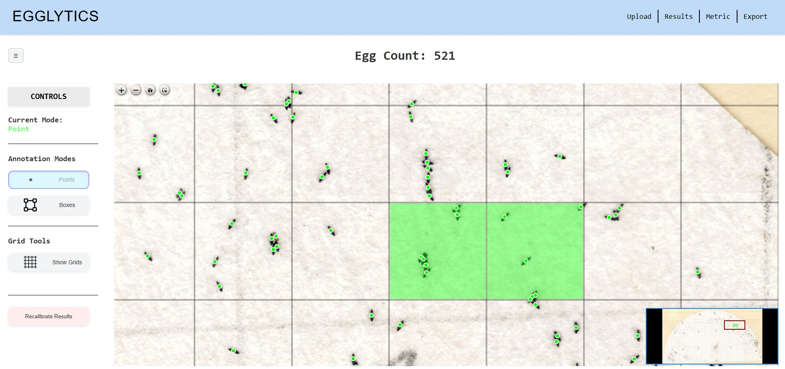

# Egglytics
<p align="center">

</p>

<br>

## What is Egglytics?
Egglytics is a web application for counting mosquito eggs. Its core feature lets users review and modify annotation results produced by a UNet model from the PolyEgg study for automated detection. This ability to edit annotations creates a feedback loop that extends the study, by generating corrected data for retraining and improving the model.

## Interfaces of the application

<p align="center">
<h1 align = "center"> Upload Interface </h1>
<h3 align = "center" >
  On this page, the user can upload images, select the image type, edit images, and choose a model for processing.
</h2>

</p>


<p align="center">
<h1 align = "center"> View Results </h1>
<h3 align="center">
  On this page, the user can view and filter batches. Users can also edit the batch name, update the number of hatched eggs, and view the details of each individual image.
</h3>


</p>


<p align="center">
<h1 align = "center"> Editor Interface </h1>
<h3 align="center">
    On this page, users can edit and review the annotations. If the annotations seem incorrect, users may recalibrate them.
</h3>

</p>


## Summary Table Of Results
To Follow

## Links to trained weights
Redacted

## Comparison Table Against Other Applications

<div align="center">

| Application Name | Method | Requires Manual Configuration | Open Source | Platform |
| :---: | :-: | :-: | :-: | :-------: |
| MECVision | Traditional Image Processing | No | Yes | Web
| Ovitrap Monitor | Traditional Image Processing | Yes | Yes | Web
| ICount | Unspecified Deep Learning Model | Yes | Yes | Windows
| EggCountAI | R-CNN | Yes | Yes | Windows
| **Egglytics** | **U-Net** | **No** | **Yes** | **Web** |

</div>

## For Developers
## I. Installation of Requirements
1. Install [Postgres](https://www.postgresql.org/download/)
2. Create a Virtual Environment (VENV) on a folder (Root) using "python -m venv ENV_NAME_HERE"
3. Activate VENV "ENV_NAME_HERE\Scripts\activate.bat"
4. On folder (Root) clone repository 
2. Activate Venv and install requirements using "pip install -r requirements.txt" for both web application and compute

## II. Initial Database Setup
1. Login to postres using Shell "psql -U posgres"
2. Create a database using "CREATE DATABASE egglytics;"
3. Check if the database is created using "\l"

## III. Initial env setup
1. Create a .env file on ROOT of web application folder
2. In this .env file add these lines

SECRET_KEY="YOUR_KEY"

DB_NAME='egglytics'

DB_USER='postgres'

DB_PASSWORD='YOUR_POSTGRES_PASSWORD'

DB_HOST='localhost'

DB_PORT='5432'

3. On SHELL go to ROOT directory of the webapplication and activate venv
4. Change directory to server "cd server"
5. Create the tables in the database using "python manage.py migrate"
6. To test for creation success in the Postgres shell connect to the database "\c egglytics"
7. Check if the tables are there using "\d"
   
### IV. Running the Web Application
1. On SHELL go to ROOT directory and activate venv
2. Change directory to server "cd server"
3. Run the server using "python manage.py runserver"
4. Access website on Localhost port 8000 (http://127.0.0.1:8000/)

### V. Running the Compute server
1. On SHELL go to ROOT directory and activate venv
2. python app.py

## VI. Deploying Your Own Model
<h2 align="center">1. Adding a New Model on Front-end</h2>

```
server
└── egglytics
    └── static
        └── js
            ├── image_upload
            │   ├── ModelConfig.js   [1]
            │   └── TableHandler.js [2]
            │   └── UploadHandler.js [3]
```

You may follow this walkthrough in implementing **"my_model"**, or add your own model in **ModelConfig.js [1]** `MODELS` array.

```javascript
// Parameters:
// value - Used by the back-end
// label - Displayed to the user in the front-end

// The default selected label (Front-end) is the first item in the array.
static MODELS = [
  { value: "foo", label: "bar" },
  { value: "foo1", label: "bar1" },
  { value: "my_model", label: "Sample_model" }
]
```

<hr>
<h2 align="center">1.1 Files involved in loading these models </h2> 
<h5 align="center"> <strong> (Skip this if you didn't add additional parameters) <strong> </h5>

<h2> TableHandler.js [2] </h2>

```javascript
createModelCell(index) {
    *..
    this.models.forEach((model) => {
        const option = document.createElement("option");
        // Add your new paramaters here
        option.value = model.value;
        option.textContent = model.label;
        // [SAMPLE]
        //option.mynewparam = model.mynewparam;
        modelSelect.appendChild(option);
    });
    ..*
}
```
<h2> image_upload_handler.js [4] </h2>

```javascript
function loadModels() {
    *..
    models.forEach(model => {
        $allModel.append(
            $("<option>", {
                value: model.value,
                text: model.label
                // [SAMPLE]
                //option.mynewparam = model.mynewparam;
            })
        );
    });
    ..*
}
```

<h2 align="center"> 2. Sending details to server </h2>

```
├───egglytics
│   └── static
│   │   └── js
│   │       ├── image_upload
│   │       │   ├── UploadHandler.js [1]
│   ├───views
│   │   │   upload.py [2]
|   ├───urls.py[3]
```

<h3 align="center"> UploadHandler.js[1] sends an upload request to the server (JS to Python) </h3>

<h2> UploadHandler.js[1] </h2>

```javascript
async submitUpload() {
    ...

    return new Promise((resolve, reject) => {
        $.ajax({
            // URL route defined in urls.py [3]
            url: "/",
            type: "POST",
            data: formData,
            processData: false,
            contentType: false,
            ...
        });
    });

    ...
}
```

<h3 align="center">urls.py[3] Routes the request to upload.py[2]</h3>

<h2> urls.py[3] </h2>

```python
from .views import upload

# This is the default route used to handle all uploads. Requests sent to "/" are handled by upload.py [2]
path("", upload.upload, name="upload"),
```

<h2> upload.py[2] </h2>

```python
def process_images(batch, files_data, header):
    *..
    for i, file_dict in enumerate(files_data, start=0):
        try:
            ...
            ## Your Model (This is @Param "value" in ModelConfig.js)
            model = file_dict["model"]
        
            ## You might need this if you have micro/macro pipelines.
            mode = file_dict["mode"]

            ...
            ## Default payload
            payload = {'image': encoded,'mode': mode}
            ...

            match model:
                case "polyegg_heatmap":
                    ...
                case "free_annotate":
                    ...
                # Note here that in the CASE statement "my_model" is the "value" 
                # parameter in your MODELS array in ModelConfig.js.
                # Ensure that the ip address, port, and method name matches on your compute server. 
                # Try block is used here since if the server is closed, 
                # the an error will occur even before reaching the status_code.
                case "my_model":
                    try:
                        response = requests.post(
                            "http://127.0.0.1:5000/my_method_name",
                            json=payload,
                            timeout=300
                        )
                        data = response.json()
                        status_code = response.status_code
                    except requests.exceptions.RequestException as e:
                        ...
            ...
  ...
```

<h2 align="center"> 3. Compute Server Processing and Return of Data </h2>

```
├───compute
    └── app.py [1]
    └── model_weights [2]
```

<h3 align="center"> 3.1 Adding your own model </h2>
    Add your model in the model_weights[2] folder, by default ONNX model is used.
    Then you can pre-load your own model by editing these lines

```
    # model_path = "model_weights/my_new_model.onnx"
    # your_model_here = UNetONNXPredictor(model_path)
```

<h3 align="center"> 3.2 Receiving an image from the webapp </h2>

The demo in app.py[1] "my_new_method" function returns one annotation type at random (Points,rectangles,and polygons), the image returned here is a grayscale image.   

```python

    #syntax: @app.route('@Param method:String',methods=['POST'])
    # Ensure that @Param method matches the one placed in upload.py

@app.route('/my_method_name', methods=['POST'])
def my_new_method():
    data = request.get_json()
    if not data or 'image' not in data:
        return {'status': 'failed', 'error': 'No image data provided', 'code': 1001}, 400
    
    # @Param image:type(numpyArray)
    # This is the image loaded in cv2 in BGR format.
    image = readb64(data['image'])

    # @Param node:type(String)
    # This is the mode selected (micro/macro) in String
    mode = data.get("mode") or ""

    # Chapter: Preprocessing
    # Sample code Grayscale image
    image_gray = cv2.cvtColor(image, cv2.COLOR_BGR2GRAY)

    # Chapter: Inference (Assuming that image_gray is the required input of the model)
    # See model.py for more details
    # @function predict(img, batch_size) returns numpyArray
    
    outputs = your_model_here.predict(image_gray,2)
    
    # Chapter: Post Processing
    # Sample code that returns points
    # Returns: list[tuple[int, int]] 
    # sample:[(x1,y1),(x2,y2),(x3,y3), ...]
    def findPoints():
        return [
            (1,1),
            (6,6),
            (9,9)
            ]
        
    # Sample code that returns rects (Pascal Format)
    # returns: list[list[int]] 
    # sample: [[x1, y1, x2, y2], [x1, y1, x2, y2], ...]
    def findRects():
        return [
            [1,1,2,2],
            [3,3,4,4]
            ]
    
    #Sample code that returns polygons
    # Returns: list[list[list[int]]] 
    # sample [[ [x1,y1], [x2,y2], ... ], ...]
    def findPolygons():
        return[
            [[1,1],[2,2],[0,2]],
            [[8,6],[9,2],[9,5]]
            ]
    
    # This is just an example, what it does is it gets random annotations among the three.
    # I assumed that each model only returns one type.
    import random
    detectors = {
        "points": findPoints,
        "rectangles": findRects,
        "polygons": findPolygons
    }

    dtype, func = random.choice(list(detectors.items()))
    detections = func()

    # Chapter: Returning Payload
    img_to_send = back_to_base64(image_gray)
    egg_count = len(detections)


    # This is where the compute server send back the results to the webapp.
    # Create payload form
    # Your payload MUST HAVE 
    # @Param status: type(BooleanString) <failed,complete> 
    # @Param final_image: type(base64String) 
    # @Param egg_count: type(int) 
    
    # Your payload SHOULD HAVE AT LEAST ONE 

    # @param points: list[tuple[int, int]] 
    # individual points [(x1,y1),(x2,y2),(x3,y3), ...] 

    # @param rectangles: list[list[int]] 
    # [[x1, y1, x2, y2], [x1, y1, x2, y2], ...] 

    # @param polygons: list[list[list[int]]] 
    # [[ [x1,y1], [x2,y2], ... ], ...]

    payload = {
        "status": "complete",
        "final_image": img_to_send,
        "egg_count": egg_count,
        # Usually those the selected annotation is placed here.
        # ex.
        # "points": detections
    }

    # Usually this part is already included on the payload above,
    # But since this is a demo of random annotations, we only select which one we used.

    # Insert the correct detection type
    if dtype == "points":
        payload["points"] = [(int(x), int(y)) for x, y in detections]

    elif dtype == "rectangles":
        payload["rectangles"] = detections

    elif dtype == "polygons":
        payload["polygons"] = detections


    # Actually send the payload pack
    return payload, 200

```


### VII. Important Notes
1. Check gitIgnore before pushing
2. HTML Files on Egglytics/Templates
3. JS Scripts on Egglytics/static/js
4. URLS on Egglytics/urls.py
5. Views on Egglytics/views.py

## For Users
The application is currently in its early development phase and is not yet ready for use.

## To Do List:
1. Frontend fixes
